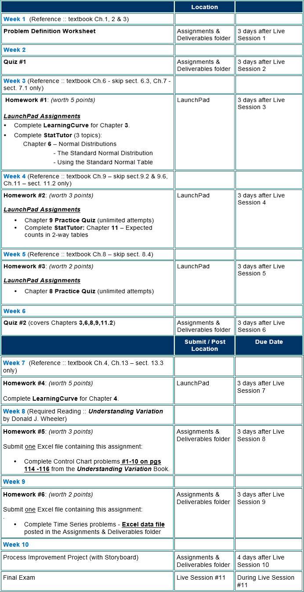

## Ryan Timbrook (Graduate Student - Course Work Repository)

## [Syracuse University, Masters of Applied Data Science](https://ischool.syr.edu/academics/graduate/masters-degrees/ms-in-applied-data-science/)
### MBC 638 Data Analysis and Decision Making - Summar 2018
### SYLLABUS

                                          **SYRACUSE UNIVERSITY WHITMAN SCHOOL OF MANAGEMENT**
                                            **MBC 638 - Data Analysis and Decision Making** 

Learning Outcomes:   
Course Description: 
This course will familiarize students with the assumptions underlying various statistical techniques and assist in identifying their appropriateness in a variety of situations.  The student should be able to perform statistical analysis and interpret results in a meaningful way.  Students are expected to relate results of such analyses to become an information-based decision maker. 
 
Learning Objectives: 

• Help students understand the value of data collection and analysis in acquiring knowledge and making decisions in today’s business environment. 
 
• Students will be able to identify and apply the appropriate statistical technique for a given set of conditions in order to answer a particular question. 
 
 
 
  Weekly Schedule:

[SYRACUSE UNIVERSITY WHITMAN SCHOOL OF MANAGEMENT](https://whitman.syr.edu/)
