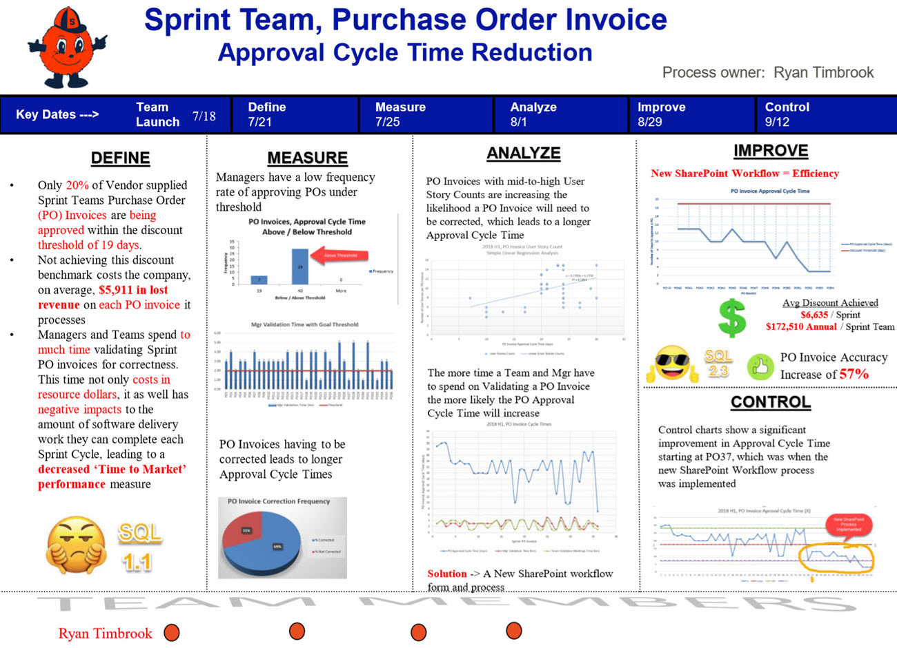

**Author:** Ryan Timbrook  
**Project:** IST 736 Text Mining - Final Project  
**Topic:**  Process Improvement Project 
**Date:** 12/8/2019  
 
# **Software Development - Service Providers - Agile Sprint Teams - Purchase Order Invoice Approval Cycle Time Reduction**

## Project Objective:
Reduce cycle time management and team spends validating service provider purchase order invoice accuracy.

### Project Requirements:

#### 
--------------------------------------------------------------------------

### Project Definition:
#### 
--------------------------------------------------------------------------

### Project Outcome Executive Report:
#### 
--------------------------------------------------------------------------

